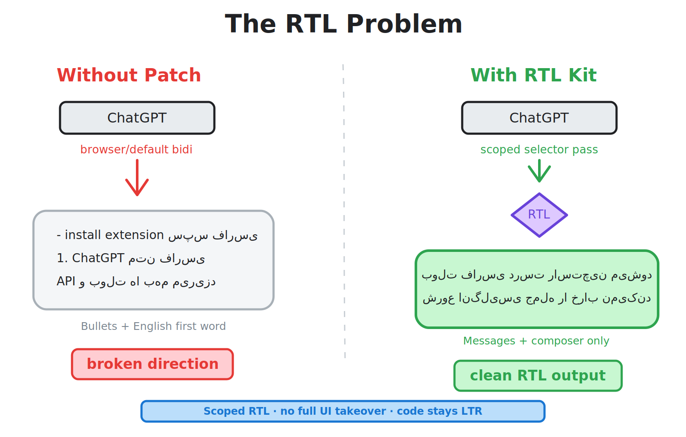
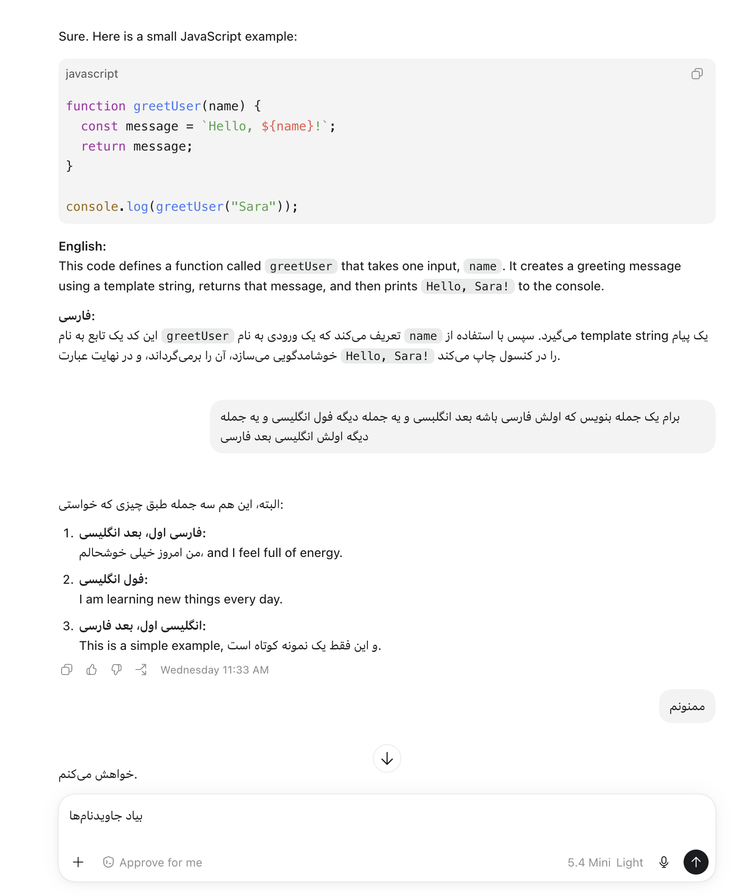
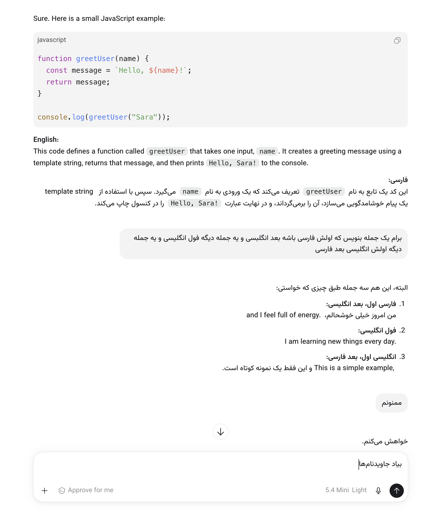
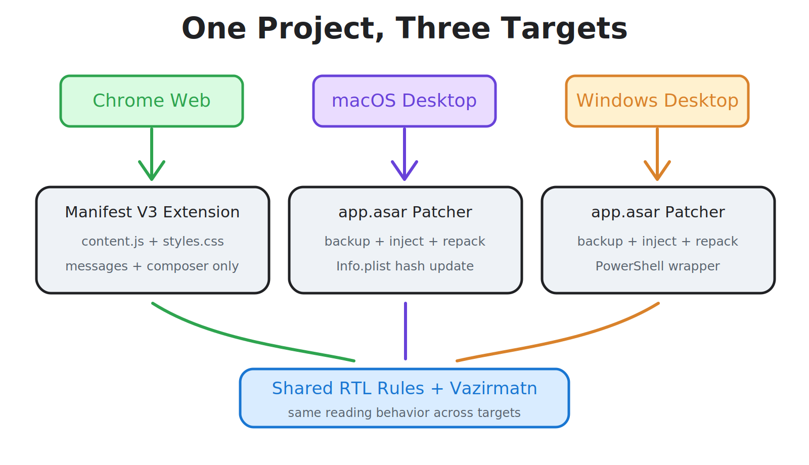

<div align="center">
  

  <br>

  [](chrome-plugin/manifest.json)
  [](https://github.com/shahinesi/chatgpt-persian-rtl/actions/workflows/validate.yml)
  [](LICENSE)
  [](SECURITY.md)

  <br>

  <strong>npm version</strong> · <strong>License: MIT</strong> · <strong>PRs Welcome</strong> · <strong>GitHub stars</strong>

  <br><br>

  [🇮🇷 نسخه فارسی](README-FA.md) | [🇸🇦 العربية](README-AR.md) | [🇮🇱 עברית](README-HE.md) | [🌍 English](README-EN.md)
</div>

# 🌟 ChatGPT Persian RTL Patcher
**تصحيح تلقائي لاتجاه الكتابة من اليمين إلى اليسار وطباعة جميلة لتطبيق ChatGPT Desktop ونسخة الويب.**

هذه حزمة ذكية لدعم RTL في ChatGPT، ولها مساران أساسيان:

<p align="center">
✨ *بمحبة للغات العربية والفارسية والعبرية وكل اللغات التي تُكتب من اليمين إلى اليسار؛ وVazirmatn تكريمًا لذكرى صابر راستيكردار.* ✨
</p>

- `chrome-plugin/` لإضافة كروم ونسخة الويب
- `desktop/` لحزمة التصحيح والاسترجاع لتطبيق ChatGPT على macOS وWindows

> هذا المشروع مستقل تمامًا ولا ينتمي إلى OpenAI ولا يحظى بموافقتها.

## لماذا هذا المشروع؟

<p align="center">
  
</p>

### مقارنة قبل وبعد

<p align="center">
  <table>
    <tr>
      <td align="center" width="50%">
        <strong>قبل التعديل</strong><br>
        
      </td>
      <td align="center" width="50%">
        <strong>بعد التعديل</strong><br>
        
      </td>
    </tr>
  </table>
</p>

- يجعل النص العربي والفارسي باتجاه RTL مع أولوية للقراءة
- يتعامل مع النصوص المختلطة بالإنجليزية من دون إفساد التخطيط
- لا تكسر النقاط والترقيم والاقتباسات وعناوين URL اتجاه النص
- يبقي الكود والجداول والمعادلات والمحتوى التقني LTR
- يضم خط Vazirmatn داخل المشروع ليبقى الناتج متاحًا دون اتصال
- المصدر الرسمي للخط: [rastikerdar.github.io/vazirmatn/fa](https://rastikerdar.github.io/vazirmatn/fa)

## ماذا يتضمن؟

<p align="center">
  
</p>

| المسار | الناتج |
|---|---|
| `chrome-plugin/` | إضافة Manifest V3 لتطبيق ChatGPT على الويب |
| `desktop/macos/` | التثبيت والاسترجاع لتطبيق ChatGPT على macOS |
| `desktop/windows/` | التثبيت والاسترجاع لتطبيق ChatGPT على Windows |

## الميزات

- يحدد RTL/LTR اعتمادًا على النص المنظف بدلًا من الحرف الأول فقط
- يدعم الرسائل أثناء الإنشاء ومربع الكتابة
- يحافظ على LTR في `code` و`pre` و`table` و`math` والأجزاء التقنية
- يطبّق Vazirmatn على النصوص العربية/الفارسية وواجهة الإضافة
- بلا تتبع أو محللات أو طلبات شبكة أثناء التشغيل
- حفظ الإعدادات محلي فقط

## التثبيت بنقرة واحدة

<div dir="ltr" align="left">

```bash
git clone --depth 1 https://github.com/shahinesi/chatgpt-persian-rtl.git
cd chatgpt-persian-rtl/desktop
npm install
npm run patch:macos
```

</div>

<div dir="ltr" align="left">

```powershell
git clone --depth 1 https://github.com/shahinesi/chatgpt-persian-rtl.git
Set-Location chatgpt-persian-rtl\desktop
npm install
npm run patch:windows
```

</div>

### التثبيت مباشرةً من الإنترنت

<div dir="ltr" align="left">

```bash
git clone --depth 1 https://github.com/shahinesi/chatgpt-persian-rtl.git /tmp/chatgpt-persian-rtl && cd /tmp/chatgpt-persian-rtl/desktop && npm install && npm run patch:macos
```

</div>

<div dir="ltr" align="left">

```powershell
git clone --depth 1 https://github.com/shahinesi/chatgpt-persian-rtl.git $env:TEMP\chatgpt-persian-rtl; Set-Location $env:TEMP\chatgpt-persian-rtl\desktop; npm install; npm run patch:windows
```

</div>

## الاسترجاع إلى الحالة الأصلية

<div dir="ltr" align="left">

```bash
cd chatgpt-persian-rtl/desktop
npm run restore:macos
```

</div>

<div dir="ltr" align="left">

```powershell
Set-Location chatgpt-persian-rtl\desktop
npm run restore:windows
```

</div>

## المساهمة والدعوة للتطوير

إذا أردت المساهمة، فهذه أكثر المناطق قيمة:

- تحسين كشف الاتجاه للنصوص المختلطة الأكثر تعقيدًا
- تحسين التوافق مع الإصدارات الجديدة من ChatGPT على الويب وسطح المكتب
- الاختبار على macOS والمتصفحات الأخرى المبنية على Chromium
- تحسين تجربة التثبيت والاسترجاع والتغليف
- تحسين الخط والمسافات والرندر في RTL

طلبات الدمج والتقارير النظيفة والمستندة إلى أمثلة دائمًا مرحب بها.

## دعم المشروع

- ادعم المشروع بإضافة Star إلى المستودع
- إذا لاحظت عيبًا أو حالة حدية، أرسل issue دقيقًا مع مثال قصير لإعادة الإنتاج
- إذا كان لديك وقت، أرسل PR وساعد في جعل دعم الإصدارات الأحدث من ChatGPT أكثر ثباتًا

## الشكر

هذا المشروع مُنجز باحترام لجهود مبتكر خط Vazirmatn، الراحل **صابر راستيكردار**.

## الترخيص

يُنشر هذا المشروع تحت رخصة [MIT](LICENSE).
