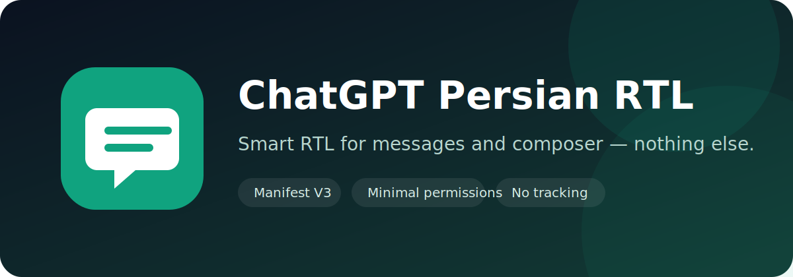

<div align="center">
  

  <br>

  [](manifest.json)
  [](https://github.com/shahinesi/chatgpt-persian-rtl/actions/workflows/validate.yml)
  [](LICENSE)
  [](SECURITY.md)
</div>

# ChatGPT Persian RTL

افزونه‌ای سبک و متن‌باز برای راست‌چین‌کردن هوشمند **فقط متن مکالمه و کادر نوشتن پیام** در ChatGPT Web؛ بدون تغییر Sidebar، منوها، Header، دکمه‌ها، Modalها، انتخاب مدل یا Layout اصلی.

> This project is independent and is not affiliated with, endorsed by, or sponsored by OpenAI.

## ویژگی‌ها

- تشخیص خودکار فارسی و عربی و نمایش به‌صورت `RTL`
- نمایش خودکار پیام‌های کاملاً انگلیسی به‌صورت `LTR`
- حفظ خوانایی متن‌های ترکیبی فارسی و انگلیسی
- حفظ `LTR` برای Code Block، Inline Code، فرمول، جدول و محتوای فنی
- پشتیبانی از پاسخ Streaming، پیام جدید و جابه‌جایی بین گفتگوها با `MutationObserver`
- فعال یا غیرفعال‌سازی فوری از Popup افزونه
- ذخیره تنظیم فقط با `chrome.storage.local`
- بدون Tracking، Analytics، درخواست شبکه یا کد Remote
- بدون وابستگی runtime و فقط با مجوز `storage`

## محدوده دقیق تغییرات

| بخش | وضعیت |
|---|---|
| متن پیام کاربر | RTL/LTR هوشمند |
| متن پاسخ ChatGPT | RTL/LTR هوشمند |
| Composer و متن در حال تایپ | RTL/LTR هوشمند |
| کد، فرمول و جدول | همیشه LTR |
| Sidebar و لیست گفتگوها | بدون تغییر |
| Header، منوها و انتخاب مدل | بدون تغییر |
| دکمه‌ها، آیکون‌ها و Modalها | بدون تغییر |
| Layout کلی ChatGPT | بدون تغییر |

## نصب سریع

### Google Chrome

1. آخرین ZIP را از بخش **Releases** دانلود و Extract کنید.
2. آدرس `chrome://extensions` را باز کنید.
3. **Developer mode** را فعال کنید.
4. روی **Load unpacked** بزنید.
5. پوشه‌ای را انتخاب کنید که `manifest.json` داخل آن است.
6. صفحه ChatGPT را Refresh کنید.

### Microsoft Edge

همین مراحل را از مسیر `edge://extensions` انجام دهید.

## نصب از سورس

```bash
git clone https://github.com/shahinesi/chatgpt-persian-rtl.git
cd chatgpt-persian-rtl
npm test
npm run build
```

فایل آماده نصب داخل `dist/` ساخته می‌شود.

## طراحی فنی

Selectorهای اصلی، معنایی و محدود هستند:

```text
#prompt-textarea
[data-message-author-role="user"]
[data-message-author-role="assistant"]
```

Fallbackهای Composer فقط داخل `form` و با `role="textbox"` یا `contenteditable="true"` محدود شده‌اند. جهت متن روی کوچک‌ترین Container متنی امن اعمال می‌شود، نه روی Wrapper اصلی پیام؛ در نتیجه ترتیب کنترل‌ها و Layout اصلی تغییر نمی‌کند.

هیچ CSS عمومی روی `html`، `body`، `main` یا Shell برنامه وجود ندارد.

## حریم خصوصی و دسترسی‌ها

```json
"permissions": ["storage"]
```

افزونه فقط وضعیت روشن یا خاموش بودن را به‌صورت محلی ذخیره می‌کند. محتوای گفتگو ارسال، ذخیره یا پردازش خارج از صفحه نمی‌شود. جزئیات بیشتر در [SECURITY.md](SECURITY.md) آمده است.

## توسعه و تست

```bash
npm test       # بررسی Syntax، Manifest، دسترسی‌ها، Scope دامنه و فایل‌ها
npm run build  # ساخت ZIP قابل انتشار
```

چک‌لیست تست دستی و قوانین Selectorها در [CONTRIBUTING.md](CONTRIBUTING.md) قرار دارد.

## گزارش مشکل

برای باگ یا پیشنهاد از قالب‌های Issue استفاده کنید. لطفاً اطلاعات شخصی یا متن واقعی گفتگوها را در Screenshot و نمونه‌ها قرار ندهید.

مشکلات امنیتی باید به‌صورت خصوصی و مطابق [SECURITY.md](SECURITY.md) گزارش شوند.

## مجوز

این پروژه تحت مجوز [MIT](LICENSE) منتشر شده است.
