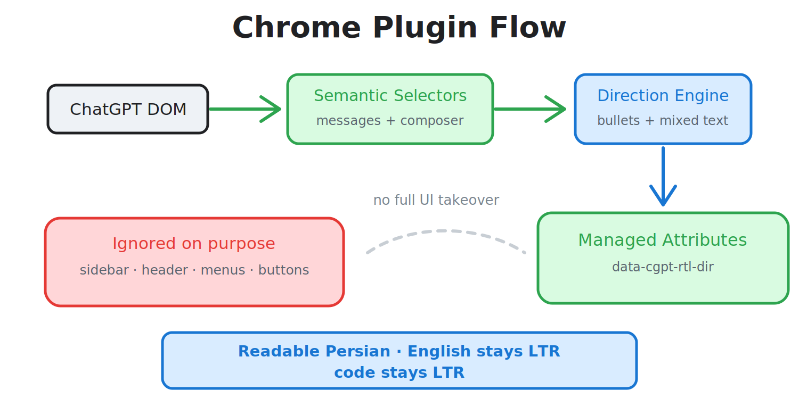

# افزونه‌ی کروم برای ChatGPT Persian RTL

این پوشه منبع اصلی افزونه‌ی کروم و نسخه‌ی وب است.

<p align="center">
  
</p>

## توسعه

```bash
npm test
npm run build
```

## فایل‌های مهم

- `content.js` منطق RTL و کادر نوشتن
- `styles.css` استایل‌های محدود به همان ناحیه و فونت
- `popup.html` و `popup.js` رابط روشن/خاموش
- `manifest.json` تعریف افزونه

## خروجی

فایل نهایی ZIP در `dist/` ساخته می‌شود و فونت Vazirmatn هم داخل بسته قرار می‌گیرد.
