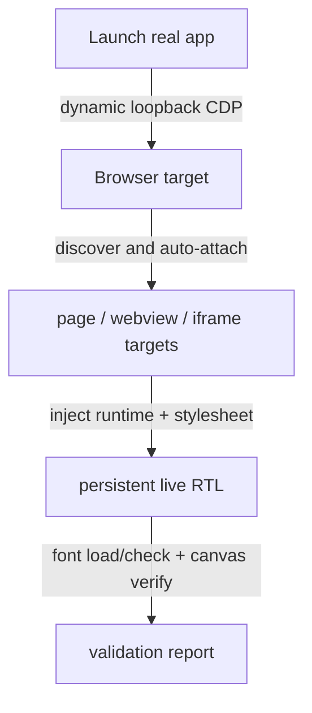

# ChatGPT Desktop RTL Runtime Design

## Overview
Apply Persian RTL support to the live ChatGPT / Codex Electron runtime without modifying the official app bundle.

## Architecture


## Components

### 1. Launcher
**Entry point**: `npm run rtl:launch`

Responsibilities:
- Quit existing `com.openai.codex` processes
- Launch `/Applications/ChatGPT.app` on a dynamic loopback port
- Keep the user’s normal profile and state
- Connect to the browser websocket endpoint
- Attach to live targets with `Target.setDiscoverTargets` and `Target.setAutoAttach`

### 2. Runtime injector
**Primary file**: `desktop/shared/rtl-runtime.js`

Responsibilities:
- Install a persistent runtime under a unique `window[PATCH_ID]`
- Create and maintain `<style id="chatgpt-rtl-style">`
- Reapply after navigation, reload, execution-context recreation, and target recreation
- Restore the style node if it is removed
- Keep bidi direction logic separate from font selection

### 3. Stylesheet
**Primary file**: `desktop/shared/rtl-patch.css`

Responsibilities:
- Define `@font-face` rules from real Vazirmatn font payloads
- Apply Vazirmatn to natural-language surfaces only
- Keep code, terminals, diffs, editors, icons, SVGs, and technical content monospace and LTR
- Expose `--font-sans` and `--font-sans-default` on app roots where available

### 4. Font validation
The launcher validates the repository-owned Vazirmatn package before injection.

Variable-first flow:
- Validate `desktop/shared/fonts/webfonts/Vazirmatn[wght].woff2`
- Require WOFF2 signature, family name, normal style, and a `wght` axis that spans roughly `100..900`
- Use a single variable `@font-face` when valid

Static fallback:
- If the variable file fails validation, use the real static WOFF2 files from `desktop/shared/fonts/webfonts/`
- Each fallback face must match its exact weight

Validation signals:
- `document.fonts.ready`
- `document.fonts.load()` and `document.fonts.check()` for representative weights
- `FontFaceSet` entries
- Canvas width comparison against fallback text rendering

### 5. Verification
The success criterion is the live application, not static tests.

Expected visible result:
- Composer uses Vazirmatn
- Persian user and assistant text use Vazirmatn
- English and mixed text remain readable
- Code remains monospace and LTR
- The persistent style survives reloads and target recreation

## Implementation Details

### Target discovery
The launcher attaches to live DOM-capable targets and ignores stale or empty targets.

```javascript
function shouldAttachTarget(targetInfo) {
  return ['page', 'webview', 'iframe', 'worker', 'service_worker'].includes(targetInfo.type);
}
```

### Persistent stylesheet
The runtime keeps one stylesheet alive and restores it when the active document changes.

```javascript
const style = document.getElementById(STYLE_ID) || document.createElement('style');
style.id = STYLE_ID;
style.textContent = css;
```

### Direction and font separation
The bidi engine remains responsible for direction, alignment, and mixed-script behavior.
The font layer only controls typeface selection and weight rendering.

## Testing and Validation

### What is still useful
- Runtime unit checks for helper logic
- Static doc and CSS sanity checks
- Launcher bootstrap validation

### What matters for success
- The real app opens
- A non-empty target list is attached
- The runtime stylesheet remains connected
- Representative font weights load and render
- Real composer and message surfaces show visible RTL with Vazirmatn

## Error Handling

| Error | Detection | Recovery |
|-------|-----------|----------|
| No remote debugging endpoint | browser websocket timeout | Fail loudly and report the blocker |
| No attached targets | empty `attachedTargets` | Fail loudly |
| Font validation failed | `document.fonts` or canvas checks | Report the exact font blocker |
| Runtime injection failed | missing style or missing runtime | Re-bootstrap or fail loudly |

## Security
- No app bundle tampering
- No secrets or credentials are stored
- No hidden fallback: failures are surfaced as structured diagnostics
- The runtime is idempotent and safe to re-run
