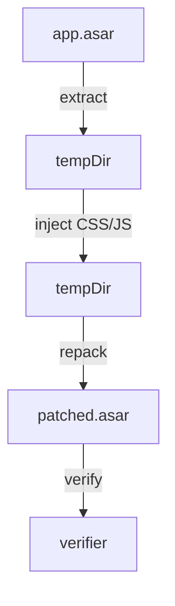

# ChatGPT Desktop RTL Patching Design

## Overview
Inject Persian RTL support into ChatGPT Desktop's Electron asar archive without source code access.

## Architecture


## Components

### 1. Patcher (`chatgpt-rtl-patcher.mjs`)
**Entry point**: `node chatgpt-rtl-patcher.mjs [--platform=macos|windows] [--restore] [--list] [path]`

**Modes**:
- **Asar mode**: `extract → inject → repack` (default)
- **Extracted dir mode**: Direct file injection (when `webview/index.html` exists)
- **Restore mode**: Rollback to backup
- **List mode**: Show CSS/JS targets

**Injection logic**:
```javascript
// CSS injection
function injectCss(file) {
  if (content.includes(marker)) return;
  writeFileSync(file, `${content}\n\n${patchCss()}\n`);
}

// JS injection
function injectRuntime(file) {
  if (content.includes(marker)) return;
  const insertAt = sourceMapMatch?.index ?? content.length;
  writeFileSync(file, content.slice(0, insertAt) + runtime + content.slice(insertAt));
}

// Layer injection
function injectLayerIntoIndexHtml(root) {
  const indexPath = path.join(root, 'webview', 'index.html');
  if (!existsSync(indexPath)) return false;
  
  const content = readFileSync(indexPath, 'utf8');
  if (content.includes(LAYER_DECLARATION_PATCHED)) return false;
  if (!LAYER_ORIGINAL_RE.test(content)) return false;
  
  writeFileSync(indexPath, content.replace(LAYER_ORIGINAL_RE, LAYER_DECLARATION_PATCHED));
  return true;
}
```

### 2. Verifier (`verify-patch.sh`)
**Workflow**:
1. Restore clean backup
2. Apply patch
3. Extract patched asar
4. Run structural checks

**Checks**:
```bash
# Layer declaration
if grep -q 'chatgpt-rtl, theme, base, components, utilities' "$INDEX_FILE"; then
  check "index.html layer declaration" "pass"
fi

# [class*="code"] selector (comment-aware)
if perl -0777 -pe 's{/\*.*?\*/}{}gs' "$cssfile" | grep -q '\[class\*="code"\]'; then
  check "No [class*=\"code\"] selector" "found forbidden selector"
fi
```

### 3. Runtime (`rtl-runtime.js`)
**Features**:
- IIFE wrapper
- `window[PATCH_ID]` guard
- `document.getElementById(STYLE_ID)` dedup
- `document.head || document.documentElement` fallback
- MutationObserver for streaming content
- Direction detection (RTL/LTR)

**Template**:
```javascript
(() => {
  if (typeof window === 'undefined' || typeof document === 'undefined') return;
  if (window[PATCH_ID]) return;
  window[PATCH_ID] = true;
  
  const css = `__CHATGPT_PERSIAN_RTL_CSS__`;
  const style = document.getElementById(STYLE_ID) || 
    Object.assign(document.head || document.documentElement, {
      appendChild: (el) => document.head.appendChild(el)
    }).appendChild(document.createElement('style'));
  
  style.id = STYLE_ID;
  style.textContent = css;
  
  // ... MutationObserver for streaming content
})();
```

### 4. CSS (`rtl-patch.css`)
**Structure**:
```css
/* Unlayered: font-face and font overrides */
@font-face { font-family: "Vazirmatn"; src: url("__VAZIRMATN_REGULAR__") format("truetype"); }
[data-message-author-role="user"] { --font-sans: "Vazirmatn" !important; }

/* Layered: direction rules */
@layer chatgpt-rtl {
  [data-cgpt-rtl-dir="rtl"] { direction: rtl !important; }
  [data-cgpt-rtl-dir="ltr"] { direction: ltr !important; }
  [data-message-author-role="user"] pre { direction: ltr !important; }
}
```

## Implementation Details

### Target Discovery
```javascript
function isRuntimeCandidate(file, root) {
  const relative = path.relative(root, file).replaceAll(path.sep, '/');
  if (!relative.endsWith('.js')) return false;
  if (relative.includes('/node_modules/')) return false;
  if (relative.startsWith('.vite/build/')) return false;
  
  return (
    /^webview\/assets\/(?:app-main|chatgpt-conversation-page|thread-user-message|composer-|local-conversation-thread|remote-conversation-page).*\.js$/u.test(relative) ||
    /^webview\/assets\/app-initial.*chatgpt.*\.js$/u.test(relative)
  );
}
```

### Layer Injection
**Before**:
```html
<style>
  @layer theme, base, components, utilities;
</style>
```

**After**:
```html
<style>
  @layer chatgpt-rtl, theme, base, components, utilities;
</style>
```

### Comment Stripping
**Problem**:
```css
/*
 * Removed [class*="code"] — it was too broad
 */
```

**Solution**:
```bash
perl -0777 -pe 's{/\*.*?\*/}{}gs' file.css | grep -q '\[class\*="code"\]'
```

## Testing

### Test Suite (`chatgpt-rtl-patcher.test.mjs`)
**Categories**:
1. **Runtime insertion**: Source map preservation, idempotency
2. **CSS validation**: No broad selectors, proper layer placement
3. **Target discovery**: Renderer vs non-renderer classification
4. **Layer injection**: Success, idempotency, whitespace handling
5. **Comment stripping**: False positive prevention
6. **Asar round-trip**: Pack/unpack preservation

**Example test**:
```javascript
test('layer-order injection succeeds against clean index.html', async () => {
  const fixtureDir = makeFixtureDir();
  writeFileSync(
    path.join(fixtureDir, 'webview', 'index.html'),
    '<html><head><style>@layer theme, base, components, utilities;</style></head></html>'
  );
  
  execFileSync(process.execPath, [patcherPath, fixtureDir]);
  
  const html = readFileSync(path.join(fixtureDir, 'webview', 'index.html'), 'utf8');
  assert.ok(html.includes('chatgpt-rtl, theme, base, components, utilities'));
});
```

## Deployment

### macOS
```bash
# Install
./install.sh

# Verify
./verify-patch.sh

# Restore
./restore.sh
```

### Windows
```powershell
# Install
install.ps1

# Verify
verify-patch.ps1

# Restore
restore.ps1
```

## Error Handling

| Error | Detection | Recovery |
|-------|-----------|----------|
| No write permission | `verifyWritableTarget()` | Fail with instructions |
| App running | `ensureTargetClosed()` | Kill processes, retry |
| No backup | `existsSync(backupPath)` | Fail with instructions |
| Extraction failed | `try/catch` | Rollback, fail |
| No targets found | `changed === 0` | Rollback, fail |

## Security
- **No network access**: All operations local
- **No secrets**: No API keys, no credentials
- **Codesigning**: macOS ad-hoc signing with `codesign --force --deep --sign -`
- **Permission checks**: Verify write access before patching
- **Rollback**: Automatic on failure
