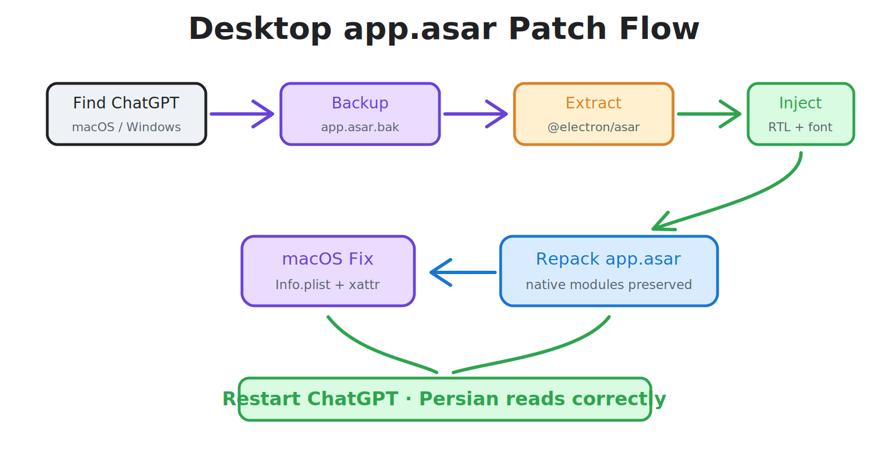
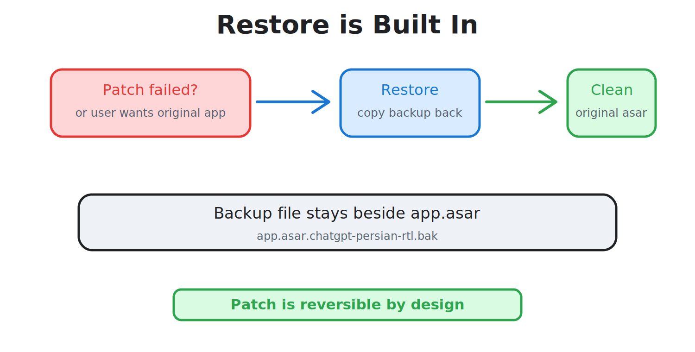

# بسته‌ی دسکتاپ برای ChatGPT

این پوشه مسیر دسکتاپ پروژه است و به دو بخش جدا تقسیم شده:

<p align="center">
  
</p>

| مسیر | کاربرد |
|---|---|
| `macos/` | نصب و بازگردانی ChatGPT Desktop روی macOS |
| `windows/` | نصب و بازگردانی ChatGPT Desktop روی Windows |
| `bin/` | patcher مشترک برای هر دو سیستم‌عامل |
| `shared/` | CSS مشترک RTL و فونت Vazirmatn |

## ایده فنی

این بخش از الگوی patcher دسکتاپ Electron الهام گرفته است: پیدا کردن `app.asar`، ساخت نسخه‌ی پشتیبان، استخراج، تزریق CSS/JS، بسته‌بندی دوباره و امکان Restore.

در macOS علاوه بر repack، hash مربوط به `ElectronAsarIntegrity` در `Info.plist` به‌روزرسانی می‌شود و signature/quarantine پاک می‌شود تا برنامه بعد از تغییر فایل asar اجرا شود.

در Windows مسیرهای رایج نصب ChatGPT بررسی می‌شوند و اگر برنامه در مسیر سفارشی نصب شده باشد، می‌توان مسیر برنامه یا خود `app.asar` را به دستور داد.

## نصب سریع

```bash
cd desktop
npm install
npm run patch:macos
```

برای Windows:

```powershell
cd desktop
npm install
npm run patch:windows
```

## بازگردانی

<p align="center">
  
</p>

```bash
cd desktop
npm run restore:macos
```

برای Windows:

```powershell
cd desktop
npm run restore:windows
```

## مسیر سفارشی

اگر ChatGPT در مسیر پیش‌فرض نیست، مسیر `ChatGPT.app`، پوشه نصب یا فایل `app.asar` را به دستور اضافه کنید.

```bash
npm run patch:macos -- /Applications/ChatGPT.app
```

```powershell
npm run patch:windows -- "$env:LOCALAPPDATA\Programs\ChatGPT\resources\app.asar"
```

## بسته آماده بدون Node.js

در حالت توسعه، patcher با Node.js اجرا می‌شود. خروجی انتشار باید به‌صورت binary یا installer بسته‌بندی شود تا کاربر نهایی به Node.js نیاز نداشته باشد.
