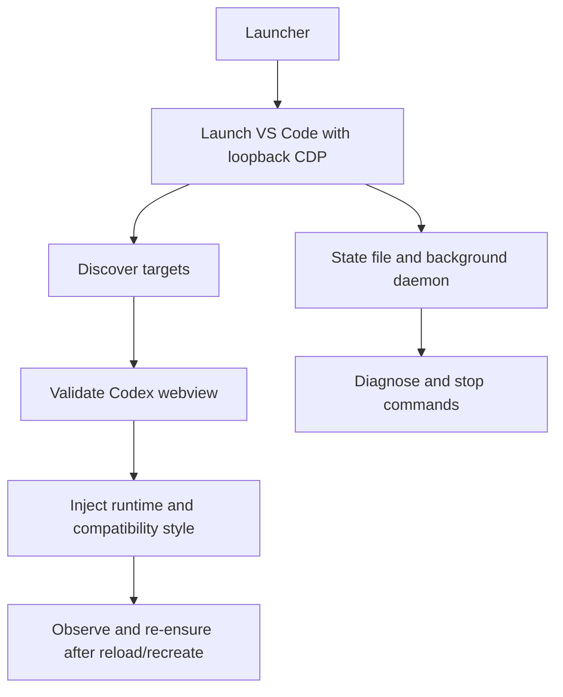

# VS Code Codex RTL Design

## Overview
هدف این مسیر، اعمال RTL فارسی و فونت Vazirmatn روی پنل Codex در VS Code است، بدون آن‌که کل رابط VS Code یا نصب اصلی آن تغییر کند.

## Architecture

## Components

### 1. Launcher
**Entry point**: `vscode/bin/codex-vscode-rtl-launcher.mjs`

Responsibilities:
- پیدا کردن VS Code یا VS Code Insiders
- انتخاب dynamic port روی `127.0.0.1`
- launch در حالت foreground یا background
- enforce کردن این شرط که VS Code عادی هم‌زمان در حال اجرا نباشد
- مدیریت mode پیش‌فرض `normal` و fallback `isolated`

### 2. Shared state module
**Primary file**: `vscode/bin/vscode-rtl-state.mjs`

Responsibilities:
- نگه‌داری مسیر canonical برای state و log
- save/load/clear state به‌صورت atomic
- helperهای `launchctl`
- health check ساده برای PID و CDP

خروجی‌های مهم:
- `STATE_FILE`
- `LOG_FILE`
- `PLIST_PATH`
- `SERVICE_LABEL`

### 3. Codex target resolution
Launcher باید بین targetهای مختلف VS Code فقط webview درست را پیدا کند.

Signals:
- `vscode-webview:` protocol
- `extensionId=openai.chatgpt`
- `purpose=webviewView`
- رد کردن `vscode-file:` مربوط به workbench
- probe کردن DOM برای textarea/contenteditable و hintهای composer

هدف این لایه این است که runtime فقط به surface واقعی Codex وصل شود.

### 4. Runtime injection
دو لایه به target تزریق می‌شوند:

1. runtime shared برای bidi logic
2. compatibility layer مخصوص VS Code برای markerها، font stack و direction روی nodeهای مدیریت‌شده

Responsibilities:
- پیدا کردن متن‌های طبیعی و editorهای مربوط به Codex
- ست کردن `data-cgpt-vscode-dir="rtl|ltr"`
- اعمال Vazirmatn روی سطوح متنی
- نگه داشتن `code` و `pre` در حالت LTR و monospace
- refresh مجدد بعد از تغییر DOM

### 5. Background mode
در mode پس‌زمینه، launcher به daemon launchd تبدیل می‌شود.

Responsibilities:
- نوشتن plist
- bootstrap/kickstart سرویس
- نگه‌داری heartbeat
- ownership روشن برای processهای launch‌شده

این لایه کمک می‌کند runtime بعد از بسته‌شدن ترمینال هم فعال بماند.

### 6. Diagnose command
**Entry point**: `vscode/bin/codex-vscode-rtl-diagnose.mjs`

Responsibilities:
- report کردن سلامت state
- بررسی alive بودن adapter و Electron
- بررسی reachability پورت CDP
- خلاصه targetهای پیدا‌شده
- warning وقتی Codex panel هنوز باز نشده یا runtime verify نشده است

### 7. Stop command
**Entry point**: `vscode/bin/codex-vscode-rtl-stop.mjs`

Responsibilities:
- unload کردن LaunchAgent
- stop کردن adapter
- kill کردن Electron مالک‌شده در صورت نیاز
- پاک کردن state و plist

## Data and Control Flow

### Foreground
1. کاربر `rtl:launch` را اجرا می‌کند
2. launcher پورت را انتخاب می‌کند
3. VS Code با CDP روی loopback بالا می‌آید
4. targetهای موجود discover می‌شوند
5. Codex webview validate می‌شود
6. runtime و style inject می‌شوند
7. observer روی recreate/reload دوباره ensure می‌کند

### Background
1. کاربر `rtl:launch:bg` را اجرا می‌کند
2. plist ساخته و سرویس bootstrap می‌شود
3. daemon VS Code را بالا می‌آورد
4. state، heartbeat و log نگه‌داری می‌شوند
5. `rtl:diagnose` و `rtl:stop` همین state را مصرف می‌کنند

## Success Criteria

- VS Code با launch adapter بالا بیاید
- CDP روی loopback reachable باشد
- پنل Codex به‌عنوان target معتبر پیدا شود
- متن‌های فارسی در Codex RTL شوند
- متن‌های mixed خوانا بمانند
- code blockها LTR و monospace بمانند
- stop و diagnose روی همان state کار کنند

## Non-Goals

- RTL کردن کل رابط VS Code
- patch کردن extension files
- پشتیبانی هم‌زمان از همه پلتفرم‌ها در این نسخه
- تغییر منطق business یا network خود Codex

## Failure Modes

| Failure | Detection | Recovery |
|---|---|---|
| VS Code عادی در حال اجرا است | launcher preflight | بستن کامل همه پنجره‌های VS Code و اجرای مجدد |
| target معتبر Codex پیدا نشد | diagnose / launcher logs | باز کردن پنل Codex و retry |
| CDP بالا نیامد | timeout روی `/json/version` | fail loud و report |
| runtime وصل شد ولی اثر بصری verify نشد | runtime report | refresh/reopen target یا به‌روزرسانی selector |
| state یا plist orphan شد | stop/diagnose | cleanup با `rtl:stop` |

## Security

- فقط loopback CDP استفاده می‌شود
- credential یا session token ذخیره نمی‌شود
- هیچ mutation دائمی روی VS Code bundle یا OpenAI extension نوشته نمی‌شود
- logها برای diagnose اپراتوری هستند، نه telemetry

## Operational Notes

- مسیر پیش‌فرض برای کاربر نهایی `rtl:launch:bg` است
- `isolated` باید fallback بماند، نه رفتار پیش‌فرض
- هر تغییر در detection باید ابتدا روی `vscode-webview` و rejectionِ `workbench` بازبینی شود
