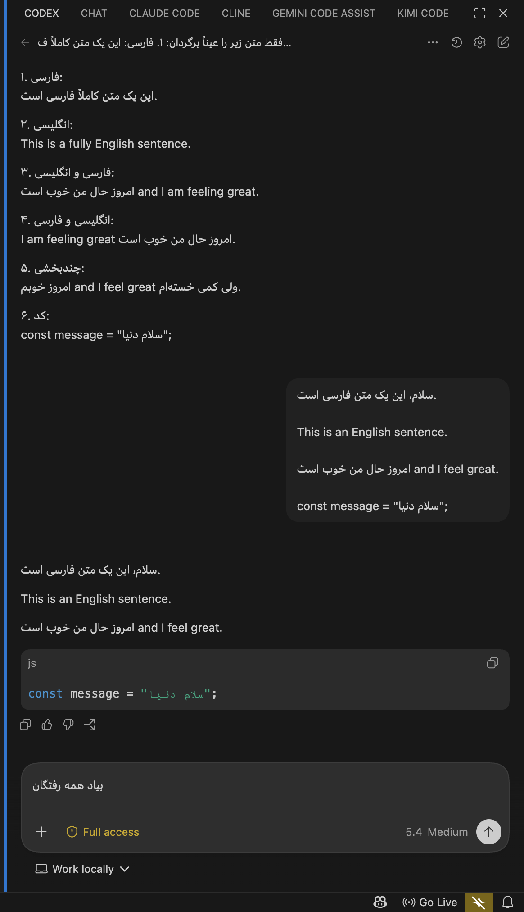
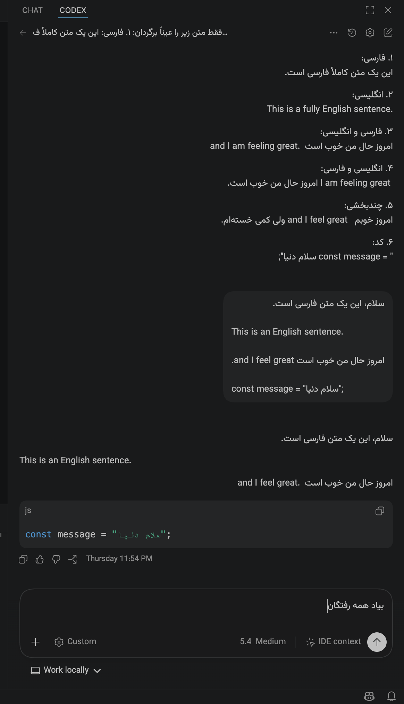

<div align="center">
  

  <br>

  [](package.json)
  [](package.json)
  [](../SECURITY.md)
  [](../LICENSE)

  <br>

  <strong>پروفایل عادی VS Code</strong> · <strong>بدون patch روی app bundle</strong> · <strong>فونت Vazirmatn</strong>
</div>

# 🌟 پچ راست‌چین Codex در VS Code
**اجرای Codex داخل VS Code با راست‌چین فارسی، فونت Vazirmatn و تشخیص درست متن‌های ترکیبی فارسی و انگلیسی.**

این مسیر مخصوص پنل Codex در VS Code است و منطق RTL زنده را بدون دست‌کاری افزونه OpenAI یا فایل‌های داخلی VS Code روی webview اعمال می‌کند.

> وضعیت فعلی این مسیر برای macOS طراحی شده و VS Code را از `/Applications` پیدا می‌کند.

## چرا این مسیر جداست؟

- مسیر `chrome-plugin/` برای ChatGPT در وب است
- مسیر `desktop/` برای اپ Desktop/Codex است
- مسیر `vscode/` فقط روی Codex داخل VS Code تمرکز دارد
- launch پیش‌فرض از پروفایل عادی VS Code استفاده می‌کند
- اگر لازم باشد fallback ایزوله هم دارد

## مقایسه قبل و بعد

<p align="center">
  <table>
    <tr>
      <td align="center" width="50%">
        <strong>قبل از پچ</strong><br>
        
      </td>
      <td align="center" width="50%">
        <strong>بعد از پچ</strong><br>
        
      </td>
    </tr>
  </table>
</p>

## چه چیزهایی را درست می‌کند؟

- متن‌های فارسی و عربی را در پاسخ‌های Codex راست‌چین می‌کند
- متن‌های mixed را بدون خراب‌کردن بخش‌های انگلیسی نمایش می‌دهد
- `code`، `pre` و محتوای فنی را LTR نگه می‌دارد
- فونت Vazirmatn را روی متن‌های قابل‌خواندن Codex اعمال می‌کند
- روی webview فعال Codex inject می‌شود، نه روی کل رابط VS Code

## نصب سریع

قبل از اولین اجرا، همه پنجره‌های عادی VS Code را کامل ببند.

<div dir="ltr" align="left">

```bash
git clone --depth 1 https://github.com/shahinesi/chatgpt-persian-rtl.git
cd chatgpt-persian-rtl
npm --prefix vscode install
npm --prefix vscode run rtl:launch:bg
```

</div>

بعد از بالا آمدن VS Code، پنل Codex را باز کن.

## دستورها

<div dir="ltr" align="left">

```bash
npm --prefix vscode run rtl:launch
npm --prefix vscode run rtl:launch:bg
npm --prefix vscode run rtl:diagnose
npm --prefix vscode run rtl:stop
```

</div>

### حالت‌ها

- `rtl:launch` اجرا در foreground
- `rtl:launch:bg` اجرا در background با LaunchAgent
- `rtl:launch:isolated` fallback با پروفایل ایزوله
- `rtl:launch:bg:isolated` همان fallback در پس‌زمینه

## رفتار اجرایی

- اگر VS Code عادی در حال اجرا باشد، launcher متوقف می‌شود تا روی همان instance تزریق اشتباه نداشته باشد
- state و log داخل `~/Library/Application Support/chatgpt-persian-rtl/vscode-profile` نگه‌داری می‌شود
- `rtl:diagnose` سلامت process، CDP و پیدا شدن webview مربوط به Codex را گزارش می‌دهد
- `rtl:stop` هم daemon و هم Electron مالک‌شده را متوقف و state را پاک می‌کند

## محدودیت‌ها

- فعلا macOS-only است
- به باز بودن پنل Codex در VS Code وابسته است
- اگر webview ساختار داخلی‌اش را عوض کند، ممکن است selectorها نیاز به به‌روزرسانی داشته باشند

## امنیت و حریم خصوصی

- بدون tracking، analytics یا تماس شبکه‌ای اضافه
- patch دائمی روی VS Code یا افزونه OpenAI نمی‌نویسد
- فقط runtime launch و injection محلی انجام می‌دهد

## لایسنس

این پروژه تحت مجوز [MIT](../LICENSE) منتشر شده است.
